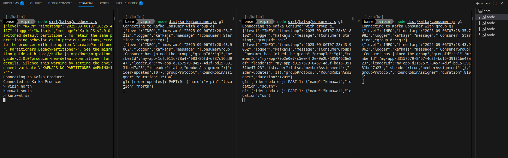

# Commands

- Start Zookeper Container and expose PORT 2181.

```bash
docker run -p 2181:2181 \
  -e ZOOKEEPER_CLIENT_PORT=2181 \
  confluentinc/cp-zookeeper:7.2.1
```

- Start Kafka Container, expose PORT 9092 and setup ENV variables.

```bash
docker run -p 9092:9092 \
  -e KAFKA_ZOOKEEPER_CONNECT=<PRIVATE_IP>:2181 \
  -e KAFKA_ADVERTISED_LISTENERS=PLAINTEXT://<PRIVATE_IP>:9092 \
  -e KAFKA_OFFSETS_TOPIC_REPLICATION_FACTOR=1 \
  confluentinc/cp-kafka:7.2.1
```

### PRIVATE_IP = Your system IP

#### Window

```bash
ipconfig
```

### Linux

```bash
ip addr show
```

## Output


